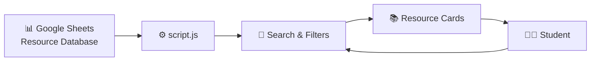

<div align="center">

<!-- ANIMATED HEADER -->
<a href="https://icse-cbse-10-12.github.io/icse-class-10-materials/">
  
</a>

<br>

<!-- TYPING ANIMATION -->
<a href="https://icse-cbse-10-12.github.io/icse-class-10-materials/">
  
</a>

<br>

<!-- BADGES -->

[](https://icse-cbse-10-12.github.io/icse-class-10-materials/)
[](https://www.youtube.com/@ICSEMasterClass10)
[](https://t.me/ICSEMasterClass10)
[](LICENSE)

<br><br>

### 📚 One Place. Every Subject. Better Preparation.

**A free digital study vault built for ICSE Class 10 students.**

</div>

---

## 🚀 Welcome to ICSE MasterClass

> **Stop searching. Start studying.**

ICSE MasterClass brings important Class 10 learning resources together in one organized digital vault.

Instead of spending hours searching across different websites, PDFs, videos and folders, students can quickly **find → open → study → practise → improve**.

---

## ⚡ The Learning Journey

```text
             📚 FIND
                │
                ▼
        🔎 SEARCH / FILTER
                │
                ▼
          📖 SELECT
                │
                ▼
          👀 PREVIEW
                │
                ▼
          📥 STUDY
                │
                ▼
          ✍️ PRACTICE
                │
                ▼
           📝 TEST
                │
                ▼
          🔍 ANALYSE
                │
                ▼
          🎯 IMPROVE
                │
                └───────────────↺
```

### 🔥 The goal

**Less time finding resources → More time actually learning.**

---

## 🌐 Open the Vault

<div align="center">

### 🎓 [ENTER ICSE MASTERCLASS](https://icse-cbse-10-12.github.io/icse-class-10-materials/)

<br>

**📚 Study Materials**  
**📝 Question Banks**  
**📄 Previous Year Questions**  
**📑 Sample Papers**  
**📖 Notes & Reference Material**  
**🎥 Video Lectures**

</div>

---

# 🎯 What You Can Find

| Resource | Purpose |
|---|---|
| 📚 **Notes** | Learn and revise concepts |
| 📝 **Question Banks** | Build question-solving ability |
| 📄 **PYQs** | Understand previous exam patterns |
| 📑 **Sample Papers** | Practise complete papers |
| 📖 **Reference Books** | Explore additional material |
| 🎥 **Video Lectures** | Learn concepts visually |
| ⭐ **Special Notes** | Quick revision and focused preparation |
| 🏛️ **Official CISCE Materials** | Access relevant official resources |

---

# 🧠 Built Around How Students Actually Study

### 01 — Learn

Understand the concept.

⬇️

### 02 — Practise

Solve questions immediately.

⬇️

### 03 — Test

Attempt structured questions and papers.

⬇️

### 04 — Analyse

Find weak areas.

⬇️

### 05 — Improve

Revise specifically where you need it.

---

# 📚 Subjects

The vault is organized around the subjects available in the project.

### 🔬 Science

- ⚡ Physics
- 🧪 Chemistry
- 🧬 Biology

### ➗ Mathematics

- Mathematics

### 🌍 Humanities

- 🏛️ History & Civics
- 🌏 Geography
- 🌱 Environmental Applications

### 💻 Applications & Commerce

- 💻 Computer Applications
- 💼 Commercial Studies
- 📊 Commercial Applications
- 💰 Economic Applications
- 🏠 Home Science
- 🏃 Physical Education

### 📖 Languages

- 📘 English Language
- 📕 English Literature
- 🇮🇳 Hindi
- 🌴 Malayalam
- 🌿 Tamil
- 🌳 Kannada

### 📦 Other

- Other Subjects

---

# 🔎 Smart Resource Discovery

The website is designed around **searching and filtering instead of endless scrolling**.

```text
Choose Subject
      ↓
Choose Category
      ↓
Filter Resources
      ↓
Find What You Need
      ↓
Open Material
```

For example:

```text
Physics
   ↓
Question Banks
   ↓
Chapter / Topic
   ↓
Select Resource
   ↓
Study
```

---

# 🏗️ How The Vault Works



### Simple architecture

**Google Sheets → JavaScript → Search/Filter → Resource Cards → Student**

This makes it possible to update resources without manually rebuilding every resource card on the website.

---

# 📂 Repository Structure

```text
icse-cbse-10-12-icse-class-10-materials/
│
├── 📄 README.md
├── 🚫 404.html
├── 🔐 google15cd0558d5c0d3f8.html
├── 🏠 index.html
├── ⚖️ LICENSE
├── 📱 manifest.json
├── 🤖 robots.txt
├── ⚙️ script.js
├── 🗺️ sitemap.xml
├── 🎨 style.css
└── ⚡ sw.js
```

---

# 🧩 File Responsibilities

| File | Purpose |
|---|---|
| `index.html` | Main vault interface |
| `style.css` | Custom visual styling |
| `script.js` | Resource loading, filtering and interaction |
| `manifest.json` | Progressive Web App configuration |
| `sw.js` | Service worker / PWA functionality |
| `robots.txt` | Search-engine crawling instructions |
| `sitemap.xml` | Search-engine discovery |
| `404.html` | Custom missing-page experience |
| `google15cd0558d5c0d3f8.html` | Google verification |
| `LICENSE` | Source-code licensing |
| `README.md` | Project documentation |

---

# 📱 Install It Like an App

The project includes **Progressive Web App functionality**.

That means supported devices can install the vault and access it more like an application.

```text
🌐 Open Website
       ↓
📱 Install
       ↓
🎓 ICSE MasterClass
       ↓
📚 Study Vault
```

The project includes:

- `manifest.json`
- `sw.js`
- Service-worker registration
- PWA installation handling
- Standalone app configuration

---

# 🎨 Design Philosophy

The interface follows a premium educational visual language:

```text
┌─────────────────────────────────────────────┐
│                                             │
│        🎓 ICSE MASTERCLASS                  │
│                                             │
│       Dark • Premium • Focused              │
│                                             │
│        🟨 Amber Accent                      │
│        ⬜ Clear Typography                   │
│        🟦 Deep Navy Background              │
│                                             │
└─────────────────────────────────────────────┘
```

### Core visual direction

- 🌑 Deep navy / dark interface
- 🟨 Amber-gold accent
- ⬜ High-contrast typography
- 🧊 Glass-style cards
- 📱 Responsive design
- 🎓 Education-first interface

---

# 🔗 The ICSE MasterClass Ecosystem

```text
                    🎓
             ICSE MASTERCLASS
                    │
       ┌────────────┼────────────┐
       │            │            │
       ▼            ▼            ▼
   🌐 WEBSITE    ▶️ YOUTUBE    💬 TELEGRAM
       │            │            │
       ▼            ▼            ▼
   Resources     Lectures      Community
   & Notes       & Concepts    & Support
```

### 🌐 Website

Central study-material vault.

### ▶️ YouTube

Concept explanations, One Shots, revision and exam-focused content.

### 💬 Telegram

Resources, updates, support and community communication.

---

# 📖 Recommended Study Workflow

### Before a chapter

```text
📚 Read the concept
        ↓
🎥 Watch explanation
        ↓
📝 Make / review notes
```

### During preparation

```text
✍️ Solve questions
        ↓
📄 Attempt PYQs
        ↓
📝 Attempt sample papers
```

### Before examination

```text
🔁 Revise
   ↓
🧠 Active recall
   ↓
⏱️ Timed practice
   ↓
🔍 Analyse mistakes
   ↓
🎯 Fix weak areas
```

---

# 💡 The ICSE MasterClass Philosophy

<div align="center">

## ❌ Don't collect resources.

## ✅ Use them.

<br>

### Finding a PDF is not preparation.

### Understanding → Practising → Testing → Analysing

### **That is preparation.**

</div>

---

# ⚡ Why This Project Exists

Students often lose valuable study time because useful material is scattered across:

- Search engines
- PDFs
- Drive folders
- YouTube
- Different websites
- Messaging groups
- Reference books

ICSE MasterClass aims to make the discovery process simpler.

> **One organized vault. Multiple learning resources. One clear goal: better preparation.**

---

# 🤝 Community

<div align="center">

### 🎓 ICSE MasterClass

**Learn. Practise. Improve.**

<br>

[▶️ YouTube](https://www.youtube.com/@ICSEMasterClass10)

[💬 Telegram](https://t.me/ICSEMasterClass10)

[🌐 Study Vault](https://icse-cbse-10-12.github.io/icse-class-10-materials/)

</div>

---

# 🛠️ Technology

The project uses a lightweight web stack:

```text
HTML
 │
 ├── Tailwind CSS
 │
 ├── Custom CSS
 │
 ├── Vanilla JavaScript
 │
 ├── Google Sheets
 │
 └── Progressive Web App
```

No heavy frontend framework is required for the core vault.

---

# 🔐 Legal & Copyright Notice

ICSE MasterClass is an independent educational project.

The website aggregates and organizes educational resources that are publicly available online. ICSE MasterClass does **not** claim to be the original author, publisher or copyright owner of third-party materials.

Third-party:

- 📚 Books
- 📄 PDFs
- 🖼️ Publisher material
- ™️ Trademarks
- 🏷️ Brand names
- 📖 Excerpts

remain the intellectual property of their respective owners.

ICSE MasterClass is **not affiliated with, endorsed by, or officially associated with CISCE**.

For copyright or takedown concerns:

📧 **icsemasterclass@gmail.com**

Valid removal requests are reviewed according to the project's stated takedown policy.

---

# 📜 License

The **source code** of this project is released under the **MIT License**.

See [`LICENSE`](LICENSE) for details.

> ⚠️ The MIT License applies to the project's source code, not automatically to third-party educational materials or copyrighted resources linked/aggregated by the website.

---

# 🌟 Final Goal

<div align="center">

## 📚 Learn

↓

## ✍️ Practise

↓

## 📝 Test

↓

## 🔍 Analyse

↓

## 🎯 Improve

<br>

### **ICSE MasterClass**

### *Study Smarter. Search Less. Achieve More.* 🚀

<br>

<a href="https://icse-cbse-10-12.github.io/icse-class-10-materials/">

</a>

</div>
